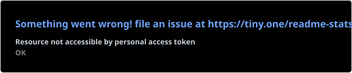

<h1 align="center">Will</h1>
<h3 align="center">Discord API Developer & Cryptography Enthusiast</h3>

  
  
  
  
  

I dig deep into Discord's internals — reverse engineering APIs, building bots, and pushing the platform way beyond what it's designed for. I work with Python and JavaScript day to day, and I have a solid understanding of cryptographic systems including Merkle trees and related structures. I build tools, break things, and occasionally fix them.

Projects: <a href="https://github.com/ItzXynx" target="_blank" rel="noreferrer">GitHub</a>

<h3 align="center">Discord Activity</h3>

  

<h3 align="center">Languages and Tools</h3>

  

<h3 align="center">Statistics</h3>

  

  
  

